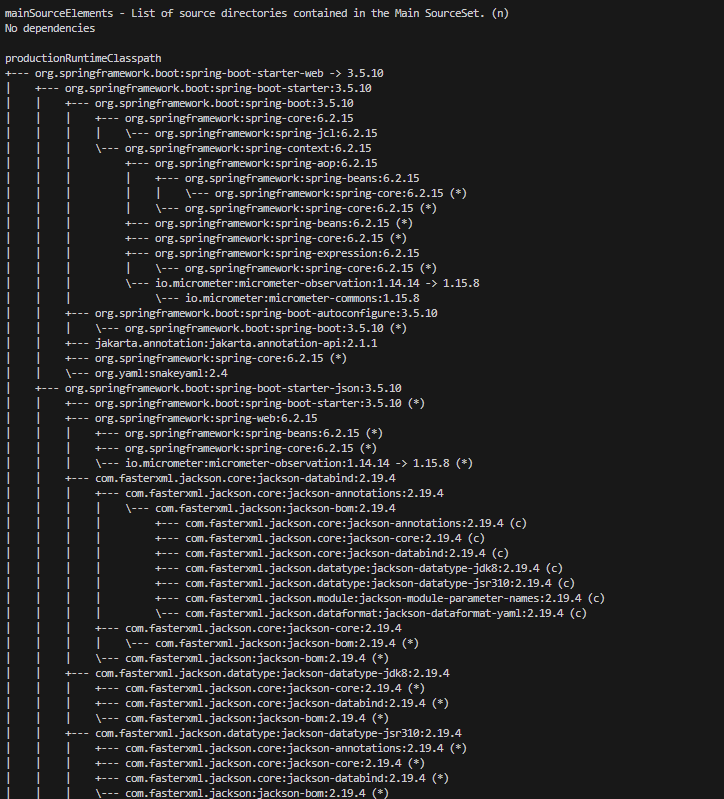
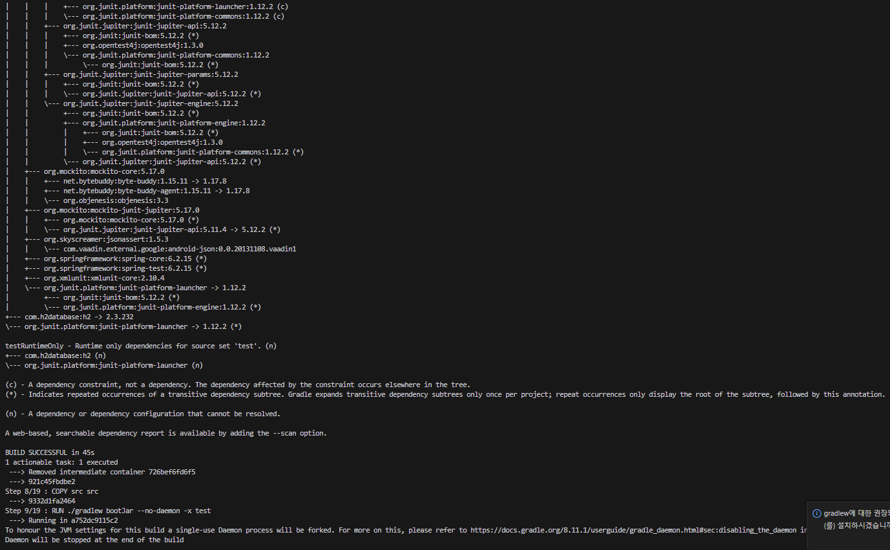
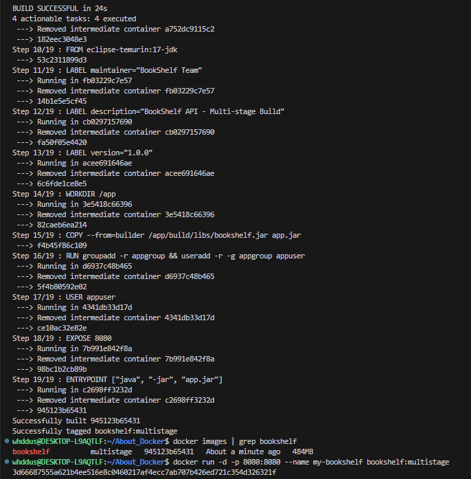

# Docker 이미지 경량화: 느린 배포의 원인과 해결책

## 서론: 왜 다시 '배포'를 이야기하는가?

### 컴퓨팅 자원 관리의 진화

| 시대  | 기술          | 특징                    | 한계                       |
| ----- | ------------- | ----------------------- | -------------------------- |
| 1세대 | Bare Metal    | 물리 서버 직접 운영     | 자원 낭비, 확장 어려움     |
| 2세대 | VM (가상머신) | 하이퍼바이저 기반 격리  | OS 전체 복제로 인한 무거움 |
| 3세대 | LXC           | 커널 공유 기반 컨테이너 | 설정 복잡성                |
| 4세대 | Docker        | 표준화된 컨테이너       | **오늘의 주제**            |

### 문제 제기

> "우리 팀은 Docker를 쓰는데 왜 배포가 여전히 느릴까?"

많은 팀이 Docker를 도입했지만, 여전히 다음과 같은 문제에 직면합니다.

- 이미지 빌드에 10분 이상 소요
- 레지스트리에서 Pull 받는 데 네트워크 병목 발생
- 클라우드 Egress 비용이 예상보다 높음
- 오토스케일링 시 새 인스턴스 기동이 느림

**이 문서의 목표**: 현상 → 원인 → 해결책 → 비즈니스 가치의 흐름으로 Docker 이미지 최적화를 완전히 이해합니다.

---

## 1. Docker의 본질 이해하기

### Infrastructure as Code (IaC)

Docker는 단순한 가상화 도구가 아닙니다. **인프라를 코드로 정의**하는 IaC의 핵심 도구입니다.

```dockerfile
# 이것은 설정 파일이 아닌, 인프라를 정의하는 '코드'입니다
FROM node:18-alpine
WORKDIR /app
COPY package*.json ./
RUN npm ci --only=production
COPY . .
CMD ["node", "server.js"]
```

### 격리 메커니즘

Docker 컨테이너의 격리는 Linux 커널의 두 가지 핵심 기능에 의존합니다.

| 기술          | 역할          | 격리 대상                    |
| ------------- | ------------- | ---------------------------- |
| **Namespace** | 프로세스 격리 | PID, Network, Mount, User 등 |
| **cgroups**   | 자원 제한     | CPU, Memory, I/O             |

이 두 기술 덕분에 컨테이너는 VM 없이도 완전한 격리 환경을 제공합니다.

---

## 2. [심층 분석] 도커 이미지는 왜 무거워지는가?

### Layer와 UnionFS의 이해

Docker 이미지는 **여러 개의 읽기 전용 레이어가 쌓인 구조**입니다.

```
┌─────────────────────────────┐
│     Container Layer (R/W)   │  ← 실행 시 생성되는 쓰기 가능 레이어
├─────────────────────────────┤
│     Layer 4: CMD            │
├─────────────────────────────┤
│     Layer 3: COPY .         │
├─────────────────────────────┤
│     Layer 2: RUN npm ci     │
├─────────────────────────────┤
│     Layer 1: FROM node      │  ← 베이스 이미지
└─────────────────────────────┘
```

UnionFS(Overlay2)는 이 레이어들을 **하나의 통합된 파일시스템처럼** 보이게 합니다.

### 레이어의 불변성: 가장 흔한 실수

> ⚠️ **핵심 포인트**: 한 번 생성된 레이어는 절대 수정되지 않습니다.

```dockerfile
# ❌ 잘못된 예시: 용량이 전혀 줄어들지 않습니다
FROM ubuntu:22.04
RUN apt-get update && apt-get install -y build-essential  # Layer A: +500MB
RUN rm -rf /var/lib/apt/lists/*                           # Layer B: +0MB (삭제 '기록'만 추가)
```

**결과**: 총 이미지 크기는 여전히 500MB 이상입니다.

```dockerfile
# ✅ 올바른 예시: 하나의 레이어에서 설치와 정리를 동시에
FROM ubuntu:22.04
RUN apt-get update \
    && apt-get install -y build-essential \
    && rm -rf /var/lib/apt/lists/*  # 같은 레이어에서 삭제 → 실제 용량 감소
```

### Copy-on-Write (CoW)

컨테이너가 실행될 때, 파일 수정은 다음과 같이 처리됩니다.

1. 원본 레이어의 파일은 **그대로 유지**
2. 수정이 필요하면 해당 파일을 **Container Layer로 복사**
3. 복사된 파일에서만 **수정 수행**

이 방식 덕분에 같은 이미지를 사용하는 여러 컨테이너가 베이스 레이어를 공유할 수 있습니다.

---

### 3. [실전 전략] 이미지 다이어트:🐋 Docker Image Optimization Roadmap

본 프로젝트는 Spring Boot 기반 애플리케이션의 배포 효율성을 극대화하기 위해 총 6단계의 이미지 최적화 과정을 수행하며, 용량(Size)과 성능(Performance) 사이의 트레이드오프를 심층 분석하였습니다.

## 🚀 단계별 최적화 상세 분석

### Stage 1: Basic (Heavyweight JDK Image)

- **핵심 변화**: 개발 환경 구성을 그대로 유지한 초기 모델.
- **기술 설명**: 실행 환경임에도 빌드 도구인 **JDK(Java Development Kit)**와 컴파일러를 포함한 베이스 이미지를 사용합니다.
- **빌드 속도**: **[매우 느림]** 매번 컨테이너 내에서 전체 의존성을 내려받고 컴파일을 수행합니다.
- **한계점**: **775MB**의 비대한 용량과 넓은 공격 표면(Attack Surface)으로 인해 운영 환경에 부적합합니다.

### Stage 2: Multi-stage Build (Logical Separation)

- **핵심 변화**: 빌드 환경과 실행 환경의 물리적 격리.
- **기술 설명**: 빌드 스테이지에서 생성된 app.jar만 실행 스테이지로 복사합니다. 이 과정에서 **소스 코드와 빌드 잔여물**이 이미지에서 완전히 제거되었습니다.
- **빌드 속도**: **[보통]** 구조적 개선은 이루어졌으나 실행 엔진 자체의 무게는 변함이 없습니다.
- **한계점**: 용량이 **484MB**로 줄었으나, 여전히 실행에 불필요한 JDK 전체가 포함되어 있습니다.

### Stage 3: JRE Only (Engine Replacement)

- **핵심 변화**: **JDK(개발용)**를 제거하고 **JRE(실행 전용)** 도입.
- **기술 설명**: 컴파일이 완료된 JAR 파일은 실행용 라이브러리만 있으면 됩니다. 따라서 무거운 JDK 대신 실행 전용 엔진인 **JRE(Java Runtime Environment)**로 교체하여 **327MB**까지 감량했습니다.
- **빌드 속도**: **[보통]** 엔진 교체는 실행 시의 이점을 주며 빌드 사이클은 이전과 유사합니다.

### Stage 4: Alpine Linux Base (OS Light-weighting)

- **핵심 변화**: 범용 OS(Ubuntu)에서 **초경량 OS(Alpine)**로 기반 전환.
- **기술 설명**: 표준 리눅스의 유틸리티를 제거하고 5MB 수준의 핵심 커널만 남긴 **Alpine Linux** 베이스를 사용하여 **245MB**를 달성했습니다.
- **빌드 속도**: **[빠름]** 베이스 이미지가 가벼워 이미지 Pull/Push 속도가 비약적으로 향상됩니다.

### Stage 5: Custom JRE with Jlink (Modular Optimization) 🏆

- **핵심 변화**: JRE 전체 대신 **필수 모듈만 조립한 커스텀 엔진** 제작.
- **기술 설명**: Java 9+ 모듈 시스템(`jlink`)을 사용해 앱 구동에 필요한 11개 핵심 모듈만 추출했습니다.
- **빌드 속도**: **[빠름]** 최종 이미지가 **127MB**로 최소화되어 배포 효율이 극대화됩니다.
- **성과**: 초기 대비 **84% 절감**. 용량 측면에서 가장 효율적인 모델입니다.

### Stage 6: GraalVM Native Image (AOT Compilation)

- **핵심 변화**: JVM을 제거하고 **기계어 바이너리**로 직접 번역.
- **기술 설명**: 자바 바이트코드를 빌드 시점에 OS가 즉시 실행 가능한 바이너리로 변환(AOT)합니다.
- **용량 분석 (Jlink와의 역전 현상)**:
  - 본 프로젝트에서 Native(**137MB**)가 Jlink(**127MB**)보다 크게 측정된 이유는 **Spring Boot + JPA(Hibernate)** 특성에 기인합니다.
  - 런타임에 필요한 리플렉션 설정, 프록시 클래스, 프레임워크 지원 코드 등 '부수 짐'이 바이너리에 포함되면서, 순수하게 필요한 모듈만 추출한 Jlink보다 덩치가 커지는 결과가 발생했습니다.
- **빌드 속도**: **[매우 느림]** 고도의 정적 분석으로 인해 빌드에 막대한 리소스가 소모됩니다.
- **실행 속도**: **[압도적 우위]** JVM 기동 과정(Warm-up) 없이 **0.1초 내외**로 즉시 실행됩니다.

---

## 📊 최종 최적화 지표 요약

| 최적화 단계 | 이미지 태그           | 크기 (Size) | 빌드 속도 | 실행 속도  | 핵심 전략          |
| :---------- | :-------------------- | :---------- | :-------- | :--------- | :----------------- |
| **Stage 1** | `bookshelf:basic`     | **775MB**   | 매우 느림 | 보통       | 기준점             |
| **Stage 2** | `bookshelf:multi`     | **484MB**   | 보통      | 보통       | 빌드/실행 분리     |
| **Stage 3** | `bookshelf:jre`       | **327MB**   | 보통      | 보통       | **JDK → JRE 교체** |
| **Stage 4** | `bookshelf:alpine`    | **245MB**   | 빠름      | 보통       | **초경량 OS 적용** |
| **Stage 5** | **`bookshelf:jlink`** | **127MB**   | 빠름      | 보통       | **최소 용량 달성** |
| **Stage 6** | `bookshelf:native`    | **137MB**   | 매우 느림 | **압도적** | **최고 속도 달성** |

## 💡 종합 결론

본 실험을 통해 이미지 경량화가 단순히 용량 절감에 그치지 않고, 인프라 가용성을 약 **6배** 향상시킬 수 있음을 확인했습니다. 특히 **Jlink를 통한 모듈화**가 용량 면에서 가장 우수했으나, **서비스의 확장성(Auto-scaling)**이 중요한 환경이라면 시작 속도가 압도적인 **Native Image**가 더 적합한 선택임을 도출하였습니다.

## 💡 결론 및 시사점

1. **인프라 효율성**: 용량 최적화를 통해 동일 서버 자원에서 약 6배 더 많은 컨테이너 운용이 가능해졌습니다.
2. **배포 속도**: 이미지 크기 감소로 인해 네트워크 전송 속도가 향상되어 CI/CD 효율이 극대화되었습니다.
3. **보안 강화**: 불필요한 패키지를 제거함으로써 보안 취약점 노출을 최소화한 클라우드 네이티브 배포 표준을 확립하였습니다.

````

**실행 결과**:





- 빌드 스테이지 (image2.png): BUILD SUCCESSFUL in 45s

- 실행 스테이지 (image3.png): BUILD SUCCESSFUL in 24s

- 총 빌드시간 : 69s

**메모리 비교**:

```bash

~/About_Docker$ docker images | grep bookshelf
bookshelf          basic        010fde44c852   10 seconds ago      770MB
bookshelf          multistage   945123b65431   About an hour ago   484MB
````

---

## 4. 결과: 경량화가 CI/CD에 주는 선물

### CI 단계: 빌드 시간 감소

| 지표                | 최적화 전 | 최적화 후 | 개선율    |
| ------------------- | --------- | --------- | --------- |
| 초기 빌드           | 8분       | 3분       | 62% ↓     |
| 코드 변경 후 재빌드 | 8분       | 45초      | **91% ↓** |
| 이미지 크기         | 847MB     | 127MB     | 85% ↓     |

**개발자 생산성 향상**: 하루 10번 빌드 × 7분 절약 = **일 70분 절약**

### CD 단계: 배포 속도 향상

```
이미지 Push/Pull 속도 비교 (100Mbps 네트워크 기준)

847MB 이미지:
  Push: ~68초 | Pull: ~68초 | 총 배포: ~2분 20초

127MB 이미지:
  Push: ~10초 | Pull: ~10초 | 총 배포: ~20초
```

**장애 복구(Rollback) 시간**: 2분 20초 → 20초 (긴급 상황에서 결정적 차이)

### 운영 관점: 비용 절감

#### 1. 오토스케일링 Cold Start 개선

```
트래픽 급증 시 새 인스턴스 기동 시간:

큰 이미지 (847MB):
  이미지 Pull: 68초 + 컨테이너 시작: 5초 = 총 73초
  → 트래픽 급증 시 73초간 기존 인스턴스에 과부하

작은 이미지 (127MB):
  이미지 Pull: 10초 + 컨테이너 시작: 5초 = 총 15초
  → 빠른 스케일아웃으로 안정적 서비스
```

#### 2. 클라우드 비용 절감

```
월간 Egress 비용 계산 (AWS 기준, $0.09/GB)

시나리오: 일 100회 배포 × 30일 = 월 3,000회 배포

큰 이미지: 3,000 × 847MB = 2,541GB → $228.69/월
작은 이미지: 3,000 × 127MB = 381GB  → $34.29/월

월 절감액: $194.40 (연간 $2,332.80)
```

#### 3. 레지스트리 스토리지 비용

```
이미지 버전 100개 보관 시:

큰 이미지: 847MB × 100 = 84.7GB 스토리지
작은 이미지: 127MB × 100 = 12.7GB 스토리지

72GB 스토리지 절감
```

---

## 요약: 최적화 체크리스트

```
□ 베이스 이미지를 Alpine 또는 Distroless로 교체했는가?
□ Multi-Stage Build를 적용했는가?
□ 빌드 도구와 런타임 환경을 분리했는가?
□ Dockerfile 명령어를 변경 빈도 순으로 정렬했는가?
□ 하나의 RUN 명령에서 설치와 정리를 함께 수행하는가?
□ .dockerignore로 불필요한 파일을 제외했는가?
□ 프로덕션 의존성만 설치했는가? (npm ci --only=production)
```

---

## 참고 자료

- [Docker Official Documentation - Best practices for writing Dockerfiles](https://docs.docker.com/develop/develop-images/dockerfile_best-practices/)
- [Google Distroless Images](https://github.com/GoogleContainerTools/distroless)
- [Alpine Linux](https://alpinelinux.org/)

---

> **핵심 메시지**: Docker 이미지 최적화는 단순한 기술적 개선이 아닙니다. 개발자 생산성, 서비스 안정성, 그리고 운영 비용에 직접적인 영향을 미치는 **비즈니스 가치**입니다.
